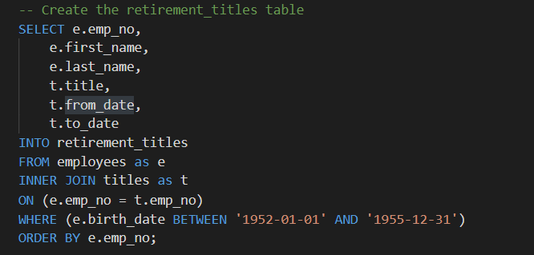
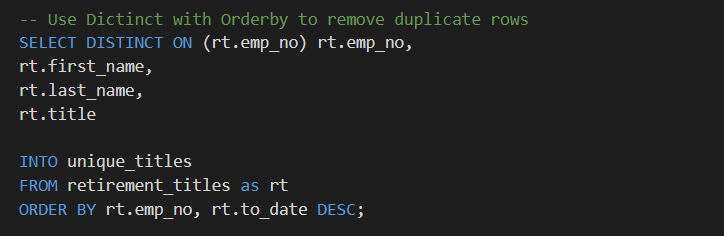
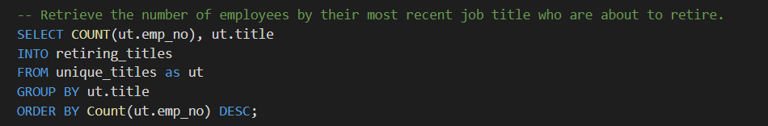
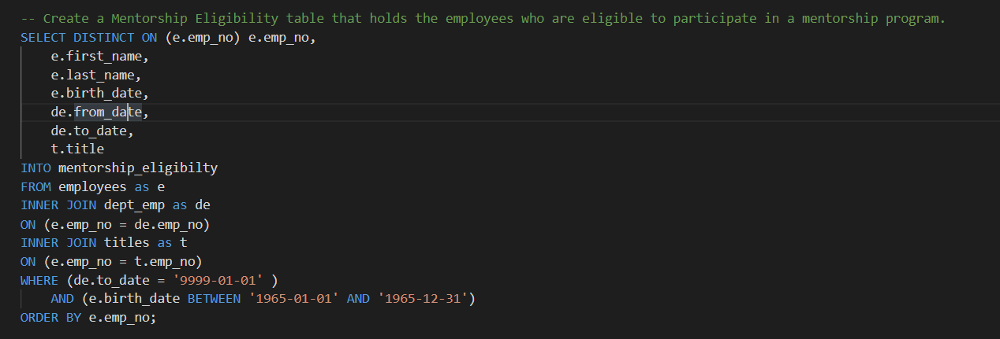

# Pewlett-Hackard-Analysis

## Overview of the analysis

Following our previous analysis of the intially provided data sets, we are given two more assignments which include determining the number of retiring employees per title, and identifying employees who are eligible to participate in a mentorship program. This will allow the resource department to plan accordingly as they prepare for this up coming shift in personel. 

## Results

### Number of Retiring Employees by Title

Our first assignment is to find the number of retiring employees per title. 

Using the code below, we created a Retirement Titles table that holds all the titles of current employees who were born between January 1, 1952 and December 31, 1955.

The results from our first code show that there are duplicate entries for some employees because they have switched titles over the years. We used the following query to remove the duplicates and keep only the most recent title for each employee. 

We then retrieved the number of employees by their most recent job title who are about to retire using the following query. 

The key results that we would like to keep in mind are: 

- The Retirement Titles table provides a total of 133,776 rows.
- The retiring titles identified are Senior Engineers, Senior Staff, Engineers, Staffs, Technical Leaders, Assistant Engineers and Managers.
- The unique numbers for each title above, removing the duplicates are 29,415, 28,254, 14,222, 12,243, 4,502, 1,761 and 2.
- The total of employees retiring in the near future is 90,398. 

### Employees Eligible for Mentorship Program

Our second assignment is to identify employees who are eligible to participate in the mentorship program. 

We had to create a Mentorship Eligibility table that holds the employees who are eligible to participate in a mentorship program using the following query. 

As a result, we find a total of 1,549 employees are eligeable to participate in the mentorship program. 

## Summary 

In the end, 

